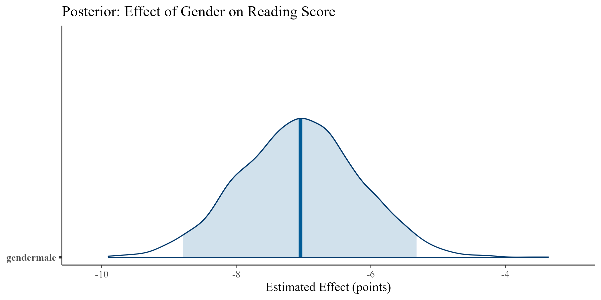
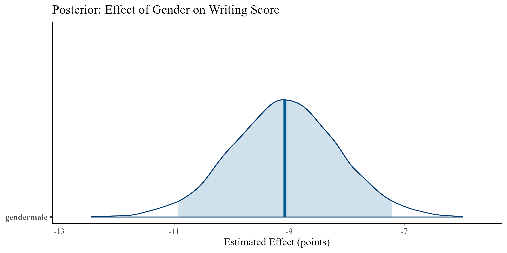
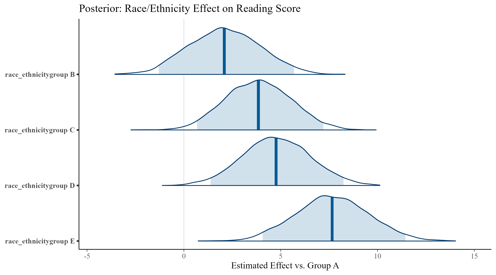

```{r setup, include=FALSE}
knitr::opts_chunk$set(echo = TRUE, message = FALSE, warning = FALSE)
```

## Introduction

This report presents a Bayesian analysis of student performance across various dimensions including test preparation, gender, parental education, lunch status, and race/ethnicity. The objective is to identify significant patterns that inform educators about students who may need support, and which interventions (e.g., test prep programs) are effective. Bayesian inference allows us to interpret probability in terms of belief and update our conclusions with data while accounting for uncertainty.

## Dataset Overview

The dataset contains test scores of 1,000 high school students in math, reading, and writing. It also includes demographic and background variables:

- Gender
- Race/ethnicity
- Parental level of education
- Lunch program (standard vs. free/reduced)
- Test preparation course (completed vs. none)


## Exploratory Data Analysis

```{r}


```

## Test Preparation and Student Scores

```{r}


```

Students who completed the test preparation course show a high probability of scoring higher in all three subjects. The effect is most pronounced in writing, suggesting that the test prep course may focus more heavily on verbal skills. All three models returned credible intervals that do not include zero, indicating a likely meaningful effect.

## Gender and Student Scores

```{r}



```

Gender differences are modest in math, but show a clearer pattern in writing, where females generally outperform males. These findings suggest that educators may want to focus on writing support for male students.

## Parental Education and Student Scores

```{r}


```

Students whose parents have higher levels of education tend to perform better, especially those whose parents hold a bachelor's or master's degree. This highlights the importance of supporting students whose parents have limited formal education.

## Lunch Program and Student Scores

```{r}


```

Students on standard lunch programs consistently score higher than those receiving free/reduced lunch. This likely reflects underlying socioeconomic disparities and reinforces the importance of additional support for lower-income students.

## Race/Ethnicity and Student Scores

```{r}



```

Differences in scores are visible across race/ethnicity groups, though some intervals overlap. Groups D and E often perform better than Group A, while Groups B and C show moderate advantages. These findings should be interpreted carefully and used to promote equity rather than reinforce bias.

## Conclusion

The Bayesian analysis provides clear, interpretable insights. Interventions such as test prep courses are associated with better outcomes. Gender and socioeconomic background also impact performance, suggesting areas where targeted support could make a meaningful difference.

Bayesian methods were well-suited for this analysis as they allow us to directly assess the probability and uncertainty of meaningful effects. While the dataset only covers one academic year, the consistent patterns across categories suggest reliability in the findings.

## Appendix

- Scripts are available in the `/scripts` directory.
- All models were run using `rstanarm` with default priors.
- Visuals were created with `bayesplot` and `ggplot2`.
